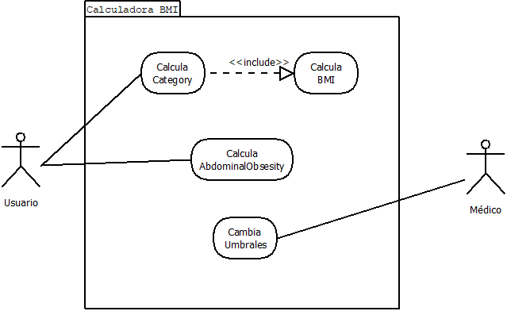

# BMI calculator
A biomedical calculator for the body mass index (BMI) and other parameters.

-- TESTS --

MÉTODO bmi :

1.Comprobar que cuando la masa o la altura es 0 devuelve error
2.Comprobar que cuando la masa o la altura es <0 devuelve error
3.Comprobación de un resultado conocido.Para 80Kg,1'8m =24.69

MÉTODO categroty :

4.Comprobar que cuando bmi es 0 devuelve error
5.Comprobar que cuando bmi es <0 devuelve error
6.Comprobar que cuando bmi es 18(<18.5) está en UNDERWEIGHT
7.Comprobar que cuando bmi es 18.5 está en NORMAL
8.Comprobar que cuando bmi es 24.9 está en NORMAL
9.Comprobar que cuando bmi es 25(>24.9) está en OVERWEIGHT
10.Comprobar que cuando bmi es 29.9 está en OVERWEIGHT
11.Comprobar que cuando bmi es 30(>29.9) está en OBESE

MÉTODO abdominalObesity:

12.Comprobar que cuando waistCircumference es 0 lanza error
13.Comprobar que cuando waistCircumference es <0 lanza error
14.Comprobar que cuando gender es un caracter no valido lanza error
15.Comprobar cuando es 89 y 'M' devuelve FALSE 
16.Comprobar cuando es 90 y 'M' devuelve FALSE
17.Comprobar cuando es 91 y 'M' devuelve TRUE  
18.Comprobar cuando es 79 y 'F' devuelve FALSE 
19.Comprobar cuando es 80 y 'F' devuelve FALSE
20.Comprobar cuando es 81 y 'F' devuelve TRUE 

-- DIAGRAMA CASOS DE USO --

-- ESPECIFICACIÓN CASO DE USO 'Calcular AbdominalObesity' --

- Nombre del caso de uso: Determinar obesidad abdominal
- Actor principal: Usuario
- Ámbito: Desarrollo aplicación de Salud
- Nivel: Funcionalidad de la aplicación
- Trigger: El usuario desea determinar si tiene obesidad abdominal o no
- Stakeholders: Usuario, médicos, desarrolladores de la aplicación o sitio web.
- Intereses: Los usuarios están interesados en conocer su índice de obesidad abdominal. Los médicos están interesados en proporcionar un diagnóstico preciso. Los desarrolladores de la aplicación o sitio web están interesados en proporcionar una herramienta precisa y fácil de usar.
- Precondiciones: El usuario tiene acceso a una calculadora de obesidad abdominal en una aplicación o sitio web.
- Garantías mínimas: La aplicación o sitio web calculará correctamente el índice de obesidad abdominal según la fórmula correspondiente y mostrará el resultado de manera clara y precisa.
- Garantía de éxito: El usuario podrá determinar si tiene obesidad abdominal o no de manera precisa y confiable.
- Escenario principal:

1. El usuario inicia la aplicación o sitio web de la calculadora de obesidad abdominal.
2. La aplicación o sitio web muestra una pantalla en la que el usuario puede introducir su género y su circunferencia de cintura.
3. El usuario selecciona su género de una lista desplegable.
4. El usuario introduce su circunferencia de cintura en el campo correspondiente.
5. La aplicación o sitio web utiliza la fórmula correspondiente según el género seleccionado para calcular el índice de obesidad abdominal.
6. La aplicación o sitio web determina si el índice de obesidad abdominal indica obesidad abdominal o no.
7. La aplicación o sitio web muestra el resultado en la pantalla, indicando si el usuario tiene obesidad abdominal o no.
8. El caso de uso termina.
- Escenarios alternativos:
1. Si el usuario no introduce un valor válido para la circunferencia de cintura, la aplicación o sitio web muestra un mensaje de error y solicita al usuario que introduzca un valor válido.
2. Si el género seleccionado no es válido, la aplicación o sitio web muestra un mensaje de error y solicita al usuario que seleccione un género válido.
3. Si la aplicación o sitio web experimenta un error inesperado, muestra un mensaje de error al usuario y el caso de uso termina.
- Extensiones:
1. Si el usuario desea obtener más información sobre cómo interpretar el resultado de la prueba, la aplicación o sitio web proporcionará información adicional.

-- Historias de usuario y escenarios --

User Story 1
Como : Usuario de la app
Quiero : Poder ingresar mi peso y altura para calcular mi BMI
De modo que : Pueda tener una idea de mi salud

User Story 2
Como : Usuario de la app
Quiero : Poder ver en qué categoría se encuentra mi BMI
De modo que : Pueda saber en que estado de salud me encuentro

User Story 3
Como : Usuario de la app
Quiero : Poder ingresar mi circunferencia de cintura y mi sexo para saber si tengo obesidad abdominal
De modo que : Para tener un mejor conocimiento de mi salud y riesgo de enfermedades.

User Story 4
Como : Médico
Quiero : Poder actualizar los umbrales de las categorías
De modo que : Los resultados se adapten a la última evidencia y pacientes

User Story 5
Como : Médico
Quiero : Poder guardar los resultados de los pacientes y acceder a ellos
De modo que : Pueda tener un seguimiento de la evolución de los pacientes.

Escenario para Story 1
Dado: Un usuario que desea calcular su BMI.
Cuando: Ingresa su peso y altura en la aplicación Calculadora BMI.
Entonces: La aplicación realiza correctamente el cálculo del BMI utilizando la fórmula correspondiente y muestra el resultado del cálculo 

Escenario para Story 1
Dado: Un usuario que desea calcular su BMI.
Cuando: Ingresa un peso o una altura no numérica en la aplicación.
Entonces: La aplicación muestra un mensaje de error indicando que se requieren entradas numéricas válidas para el peso y la altura.

Escenario para Story 2
Dado: Un usuario que desea saber en qué categoría de BMI se encuentra.
Cuando: La aplicación recibe el resultado del cálculo del BMI del usuario.
Entonces: La aplicación asigna el resultado a una de las categorías correspondientes (bajo de peso, normal, sobrepeso u obesidad) utilizando los rangos de valores adecuados y muestra al usuario su categoría de BMI.

Escenario para Story 3
Dado: Un usuario que desea saber si tiene obesidad abdominal.
Cuando: Ingresa su circunferencia de cintura y su sexo en la aplicación Calculadora BMI.
Entonces: La aplicación determina si el usuario tiene obesidad abdominal o no utilizando los rangos de valores adecuados para la circunferencia de cintura en relación con el sexo del usuario y muestra al usuario si tiene obesidad abdominal o no

Escenario para Story 3
Dado: Un usuario que desea saber si tiene obesidad abdominal.
Cuando: Ingresa una circunferencia de cintura no numérica o no positiva en la aplicación Calculadora BMI.
Entonces: La aplicación muestra un mensaje de error indicando que se requiere una entrada numérica positiva para la circunferencia de cintura 

Escenario para Story 4
Dado : Un médico que quiere cambiar el umbral de una categoría
Cuando : Selecciona el umbral a cambiar.
Entonces : Se desplegará una pantalla con entradas numericas donde deberá escribir los nuevos umbrales de la categoría.

Escenario para Story 5
Dado : Un médico que desea guardar los resultados obtenidos en el BMI por un paciente
Cuando : Pulsa el botón guardar resultado
Entonces : El resultado del paciente se guarda en una base de datos relacional junto con el ID del paciente.

-- INTERFAZ --

